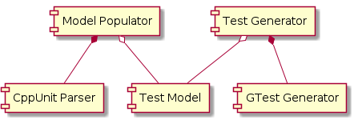

= GoGooTe design

== Purpose of GoGooTe
Currently this project (see <<project>>) serves to explore technologies (e.g. libclang or later CI), techniques (e.g. large scale automated refactorings or volatility-decomposition), and to have fun.

Currently the tool supports only the most basic CppUnit elements presented in the <<cookbook>>: a `TestCase` implementing test method `runTest` containing just `ASSERT_TRUE` statements (i.e. no non-assertion code).

== Discovery of functional requirements
One of the ideas behind the project is to explore volatility-decomposition (read <<rs>> or listen to <<ser396>>). While the book strongly discourages to base the design on functional decomposition, it suggests to use functional decomposition to uncover functional requirements.

In terms of functional requirements code generation is trivial. That's why it's not elaborated here.

== Functional requirements
* The tool shall convert common CppUnit elements to equivalent GoogleTest elements:
** CppUnit test suites
** CppUnit test fixtures
** CppUnit test cases
** most common CppUnit assertions
* Generated code shall compile.
* Order of code elements (e.g. assertions and "code to keep" blocks) shall be preserved.

== Design constraints and assumptions
- To keep GoGooTe simple generate one TU per Test-TU and include all code usually kept in header files. Rationale: This is trivial to refactor afterwards.
- To keep GoGooTe simple don't delete CppUnit Test-TUs. Rationale: This allows to compile both variants side-by-side until the GoogleTest is confirmed to be correct. CppUnit tests can be trivially removed manually.
- To keep GoGooTe simple don't automatically add newly generated source files to the build system. Rationale: Don't limit the applicability of GoGooTe to a set of specific build systems and keep maintainability of GoGooTe in check.
- To keep GoGooTe simple don't format code nicely. Rationale: can trivially apply `clang-format` afterwards.
- To keep GoGooTe simple don't optimize assertions (e.g. simplify `ASSERT_TRUE(x == true)` to `ASSERT_TRUE` or prefer link:http://hamcrest.org/[hamcrest matchers] `ASSERT_THAT(x, Eq(true))`). Rationale: This can be done by a separate tool, which is generally applicable to GoogleTest projects, not only converted ones.
- To keep GoGooTe simple the tool is built for a specific libclang version and only supports conversion from a specific CppUnit to a specific GoogleTest version. Later, more versions might be supported.
- Initially the tool is developed as hobby project by a single developer in the limited time besides the day job.
- Certain functionalities of GoGooTe cover unknown ground for the developer. That's why such functionalities might be re-designed multiple times, e.g. once as throw-away-prototype to explore the domain, once to make it correctly, once to optimize if necessary, and any number of times to explore alternative designs (which might be dropped if they don't bring benefit).
- Later on the tool might be extended to support conversion from/to other testing frameworks (e.g. Catch2, Catch1, from GoogleTest to CppUnit). If this happens, the name of the tool might change.

== High level design
The most interesting components of GoGooTe are:

The purpose of the `Test Model` is to enable future extension by other parsers and generators. The `Test Model` follows the nomenclature of International Software Testing Qualifications Board (ISTQB) and is structured as follows:

The model doesn't distinguish between a `TestSuite` and a `TestFixture`. If `TestSuite` contains a `SetupMethod`, `TeardownMethod`, or some `HelperCodeBlocks` it is to be taken as a `TestFixture` by the generator, who can ask the `TestSuite` whether it represents a fixture. The idea is to simplify population of the model and generation.

== Detail design
=== Parsing
Because the parser identifies element by element, the model is constructed using pattern "construction builder" (see <<dsl>>).

To decouple parsing from generating all relevant code is passed to the corresponding `add` method, e.g. the condition code like `x == 1` to an assertion.

=== Generating
Generating is not yet detail-designed. Candidate ideas are the visitor pattern (see <<gof>>), transformer generation, or model aware generation (see <<dsl>>).

It is clear, however, that the model must be traversed depth-first.

[bibliography]
== References
- [[[project]]] link:https://github.com/rknuus/GoGooTe[GoGooTe project page]
- [[[cookbook]]] link:http://cppunit.sourceforge.net/doc/cvs/cppunit_cookbook.html[CppUnit cookbook]
- [[[rs]]] Juval Löwy. link:https://learning.oreilly.com/library/view/righting-software-a/9780136524007/[Righting Software: A Method for System and Project Design]. Addison-Wesley. 2019.
- [[[ser396]]] Software Engineering Radio link:https://www.se-radio.net/2020/01/episode-396-barry-oreilly-on-antifragile-architecture/[Episode 396: Barry O’Reilly on Antifragile Architecture]
- [[[dsl]]] Martin Fowler. link:https://learning.oreilly.com/library/view/domain-specific-languages/9780132107549/[Domain Specific Languages]. Addison-Wesley. 2010.
- [[[gof]]] Erich Gamma et al. link:https://learning.oreilly.com/library/view/design-patterns-elements/0201633612/[Design Patterns: Elements of Reusable Object-Oriented Software]. Addison-Wesley. 1994.